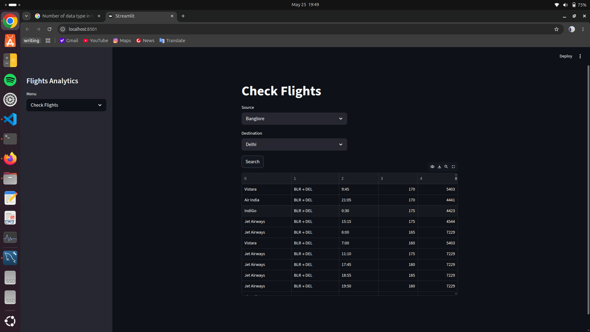

# ✈️ Flight Analytics Dashboard App

An interactive Flight Analytics Dashboard App developed using **Python, SQL, Pandas, Matplotlib, and Streamlit** to analyze airline and flight datasets. The application provides dynamic visualizations, flight search functionality, and analytical insights for exploring airline trends and operational patterns.

---

# 📌 Features

* Interactive dashboard built with Streamlit
* Flight search and filtering functionality
* Data cleaning and preprocessing using SQL and Pandas
* Exploratory Data Analysis (EDA) on airline datasets
* Dynamic visualizations including pie charts and bar graphs
* User-friendly interface for analytics and reporting

---

# 🛠️ Technologies Used

* Python
* SQL
* Pandas
* NumPy
* Plotly
* Streamlit

---

# 📊 Project Screenshots

## Flight Search Dashboard



---

## Analytics Dashboard


---

# 📈 Functionalities

### ✔ Flight Search

* Search flights based on source and destination
* Display filtered airline and flight details
* Interactive data table visualization

### ✔ Analytics Dashboard

* Airline distribution analysis using pie charts
* Comparative airline trend visualization using bar charts
* Interactive dashboard for data-driven insights

---

# 🧹 Data Processing

* Cleaned and preprocessed raw airline datasets using SQL and Pandas
* Performed aggregation, filtering, and analytical queries using SQL
* Conducted exploratory data analysis (EDA) for extracting insights

---

# 🚀 How to Run the Project

```bash
# Clone the repository
git clone <your-github-repository-link>

# Navigate to project folder
cd flight-analytics-dashboard

# Install dependencies
pip install -r requirements.txt

# Run Streamlit app
streamlit run app.py
```

---

# 📌 Resume Description

* Developed an interactive Flight Analytics Dashboard App using Python, SQL, Pandas, and Streamlit to analyze airline and flight datasets.
* Performed data cleaning, preprocessing, and exploratory data analysis (EDA) using SQL queries and Pandas.
* Designed dynamic visualizations including pie charts and bar graphs to analyze airline distribution and flight trends.
* Implemented user-driven flight search and filtering functionality for interactive analytics and reporting.

---

# 📬 Future Improvements

* Add KPI cards and advanced analytics
* Deploy application on Streamlit Cloud
* Add real-time flight data integration
* Implement predictive analytics and machine learning models

---

# 👨‍💻 Author

Developed as a Data Analytics project using Python and SQL.
